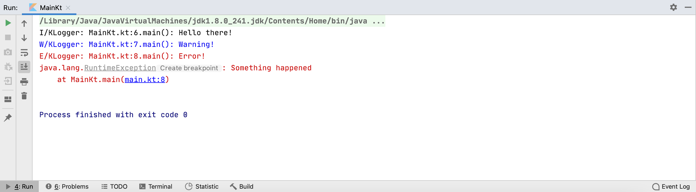
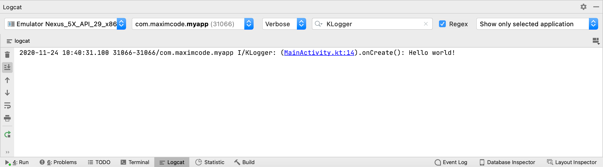

# KLogger

[](LICENSE.md)
[](https://kotlinlang.org)
[](https://jitpack.io/#merklol/RxMvi)

An easy to use and extensible logger for Kotlin.

### Getting Started

Add it in your root build.gradle at the end of repositories:

```groovy
allprojects {
    repositories {
        maven { url 'https://jitpack.io' }
    }
}
```

Add the dependencies:

```groovy
dependencies {
    implementation 'com.github.merklol.KLogger:core:0.3'

    //Printer for Android applicartions
    implementation 'com.github.merklol.KLogger:androidprinter:0.3'
}
```

### Usage

> **NOTE:**  By default, ConsolePrinter takes DebugRule as the default value. You can also use ReleaseRule instead. 
The rule hides all verbose, debug, and info log events.

```kotlin
fun main() {
    KLogger.init(ConsolePrinter(rule = ReleaseRule()))
}
```

#### 1. Kotlin

Initialize an instance of KLogger and start logging:

```kotlin
fun main() {
    KLogger.init(ConsolePrinter())
        KLogger.info("Hello there!")
        KLogger.warn("Warning!")
        KLogger.error("Error!", RuntimeException("Something happened"))
}
```

##### Output


#### 2. Android

Initialize an instance of KLogger in the Application class:

```kotlin
class App: Application() {
    override fun onCreate() {
        super.onCreate()
        KLogger.init(AndroidPrinter())
    }
}
```

Now, you can define log statements in your View files:

```kotlin
class MainActivity : AppCompatActivity() {
    override fun onCreate(savedInstanceState: Bundle?) {
        super.onCreate(savedInstanceState)
        setContentView(R.layout.activity_main)

        KLogger.info("Hello world!")
    }
}
```

##### Output



#### 3. Custom Printer

To create a custom printer, implement Printer interface:

```kotlin
class CustomPrinter(override val rule: Rule) : Printer {
    override val tag: Tag
        get() = super.tag
    
    override fun log(priority: Int, message: String?, throwable: Throwable?) {
        TODO("Not yet implemented")
    }
}
```

If you want a custom Tag, then you need to implement Tag interface:

```kotlin
class CustomTag: Tag {
    override fun toString(): String {
        TODO("Not yet implemented")
    }
}
```

In case you need a custom rule, you should implement Rule interface:

```kotlin
class CustomRule: Rule {
    override fun isPrintable(priority: Int): Boolean {
        TODO("Not yet implemented")
    }
}
```

### Contributing

If you like this project, or are using it in your app, consider starring the repository to show your support. 
Contributions from the community are very welcome.